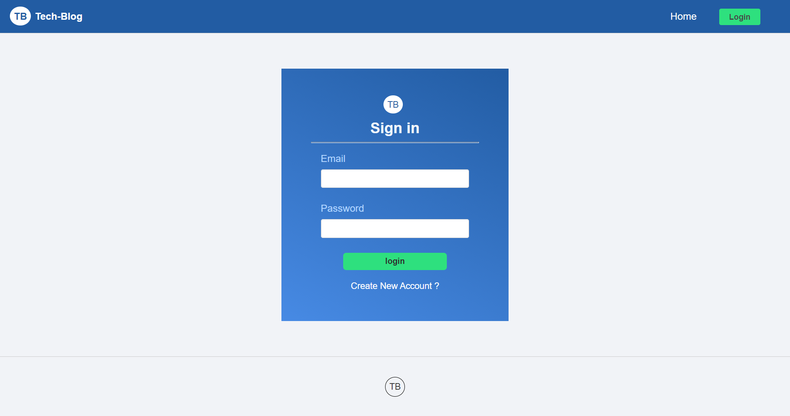
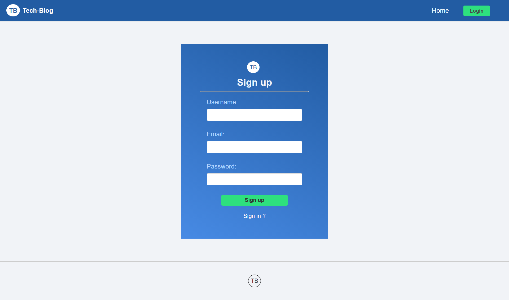
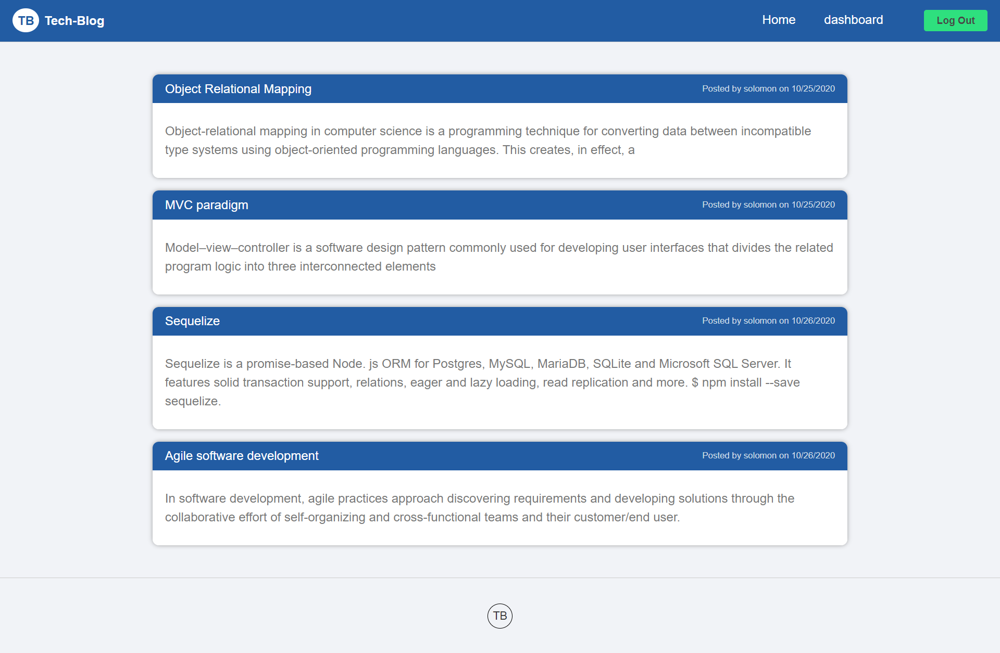
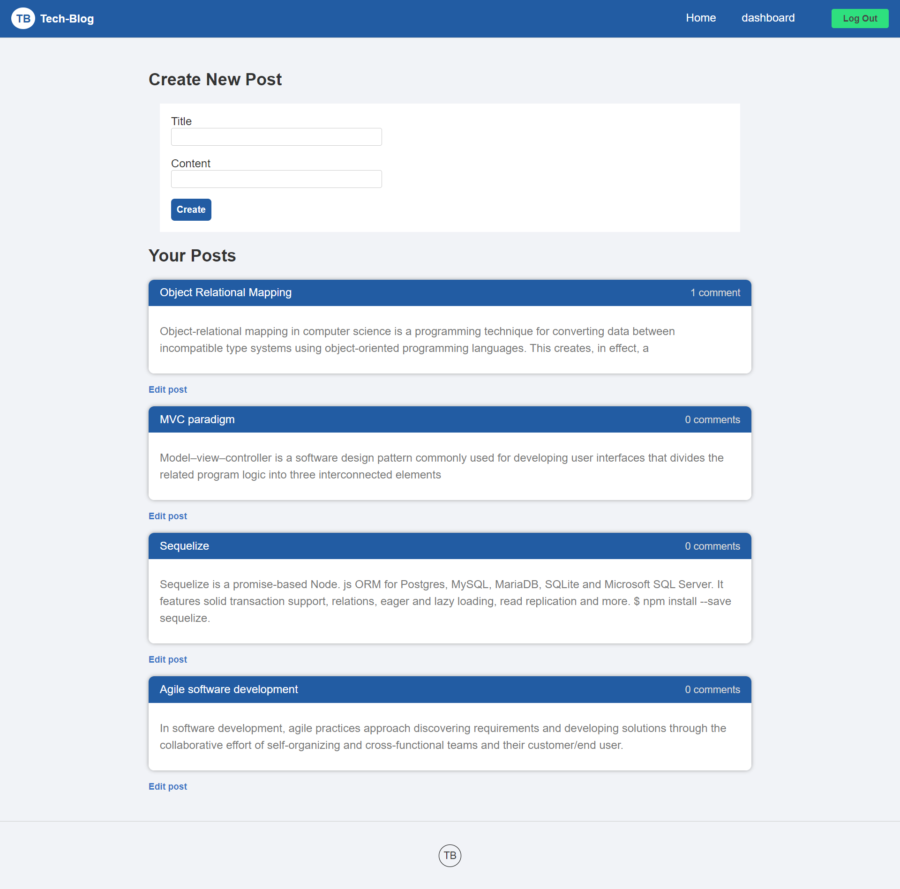
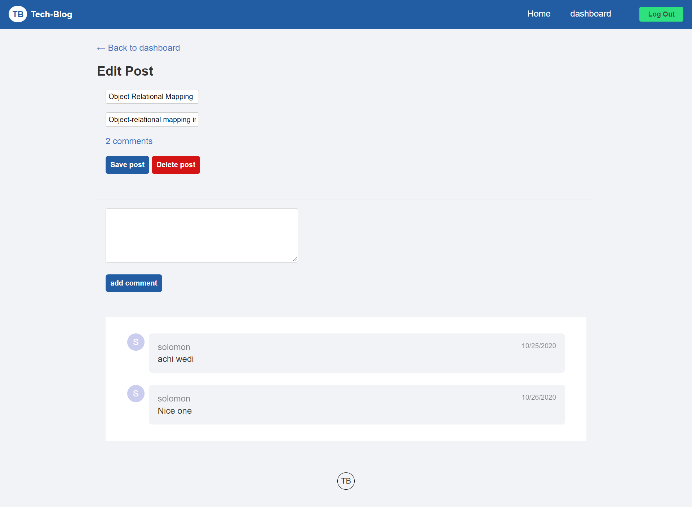
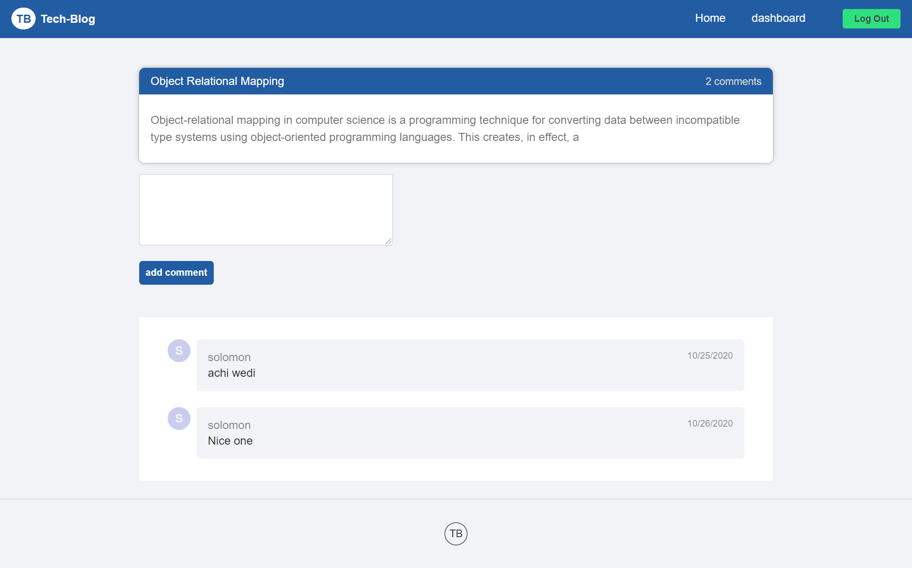
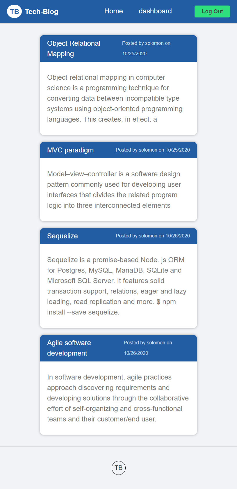
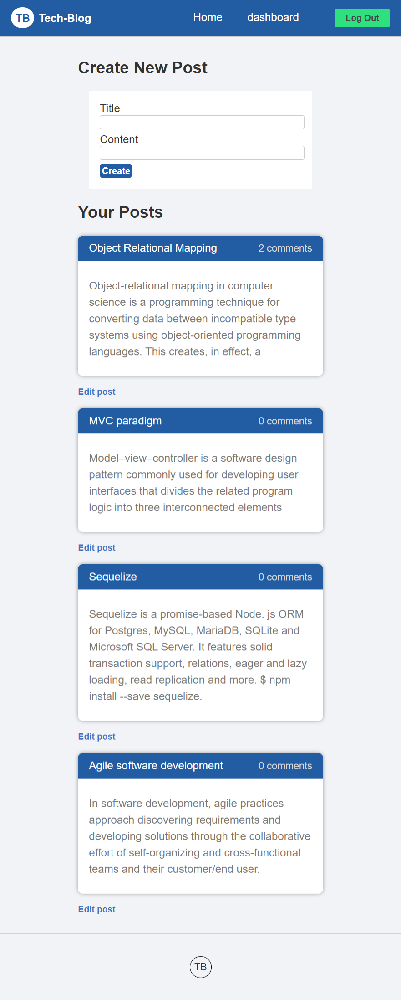

# Tech-Blog


## Description

Its fullstack web application built using Sequelize as ORM and MySql as database in the backend and handlebars template engine in the frontend.This application follows the most popular software design pattern or paradigm (MVC).Its an app were developers will post their blog regarding any topic.User can access all the posts made by other users but he has to signup and login to post new post,comment on post,delete and edit his post.

## Table of Contents

- [Built](#built)
- [Usage](#usage)
- [Credits](#credits)
- [License](#license)
- [Visuals](#visuals)

## Built

- Node
- mySQL
- Sequelize
- Handlebars
- bcrypt
- Heroku

## Usage

[Deployed](https://git.heroku.com/hidden-beach-99915.git)

## License


## Contribution

Fork it to your github ,then you can make any changes with out affecting the main source code

Once you create your database then run those scripts to seed and run server in your terminal

```javascript
👉 npm install
👉 npm run start
```

[My Github Profile](https://github.com/solomonmeresa)

## How to reach me

Email : solomonmeresa8@gmail.com

## Test

```javascript
👉 npm run test
```

## Visuals










Made by Solomon

### ©️2020 TB Tech-Blog
